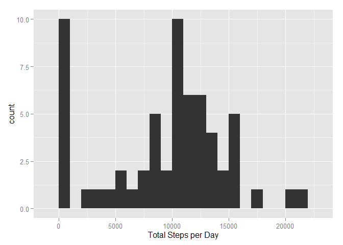
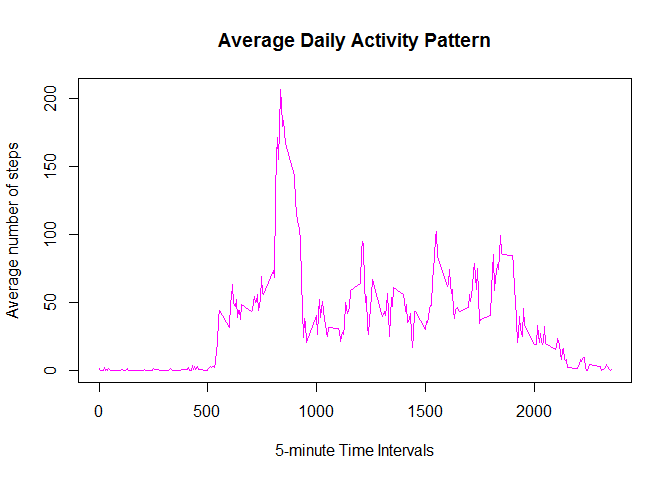

# Reproducible Research: Peer Assessment 1


## Loading and preprocessing the data


```r
df <- read.csv("activity.csv")
```

## What is mean total number of steps taken per day?


```r
steps.per.day <- tapply(df$steps, df$date, FUN=sum, na.rm=TRUE)
library(ggplot2)
qplot(steps.per.day, binwidth=1000, xlab="Total Steps per Day")
```

 

```r
mean(steps.per.day, na.rm=TRUE)
```

```
## [1] 9354.23
```

```r
median(steps.per.day, na.rm=TRUE)
```

```
## [1] 10395
```

## What is the average daily activity pattern?


```r
steps.on.average <- tapply(df$steps, df$interval, mean, na.rm = TRUE)
plot(row.names(steps.on.average), steps.on.average, type = "l", xlab = "5-minute Time Intervals", 
     ylab = "Average number of steps", main = "Average Daily Activity Pattern", 
     col = "magenta")
```

 

## Counting missing values

```r
na.tot <- sum(is.na(df))
na.tot
```

```
## [1] 2304
```

## Imputing missing values

```r
average.by.interval <- (tapply(df$steps, df$interval, mean, na.rm = TRUE))
intervals <- unique(df$interval)
averages <- data.frame(cbind(average.by.interval, intervals))

imputted.steps <- function(steps, interval) {
  imputted <- NA
  if (!is.na(steps))
    imputted <- c(steps)
  else
    imputted <- (averages[averages$intervals==interval, "average.by.interval"])
  return(imputted)
}

complete.df <- df

complete.df$steps <- mapply(imputted.steps, complete.df$steps, complete.df$interval)

# Double-checking that there are no more NAs

na.tot <- sum(is.na(complete.df))
na.tot
```

```
## [1] 0
```

## Are there differences in activity patterns between weekdays and weekends?

```r
complete.df$day <- ifelse(weekdays(as.Date(complete.df$date)) %in% c("samedi", "dimanche"), "weekend","weekday" )

averages.steps <- aggregate(complete.df$steps, by = list(complete.df$interval, complete.df$day), 
                       mean)
names(averages.steps) <- c("interval", "day", "steps")
library(lattice)
xyplot(steps ~ interval | day, averages.steps, type = "l", layout = c(1, 2), xlab = "Interval", ylab = "Number of Steps")
```

 
